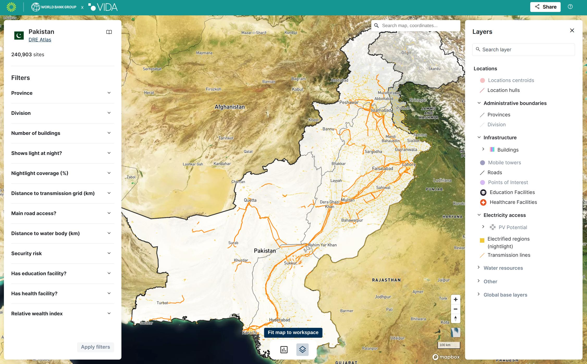
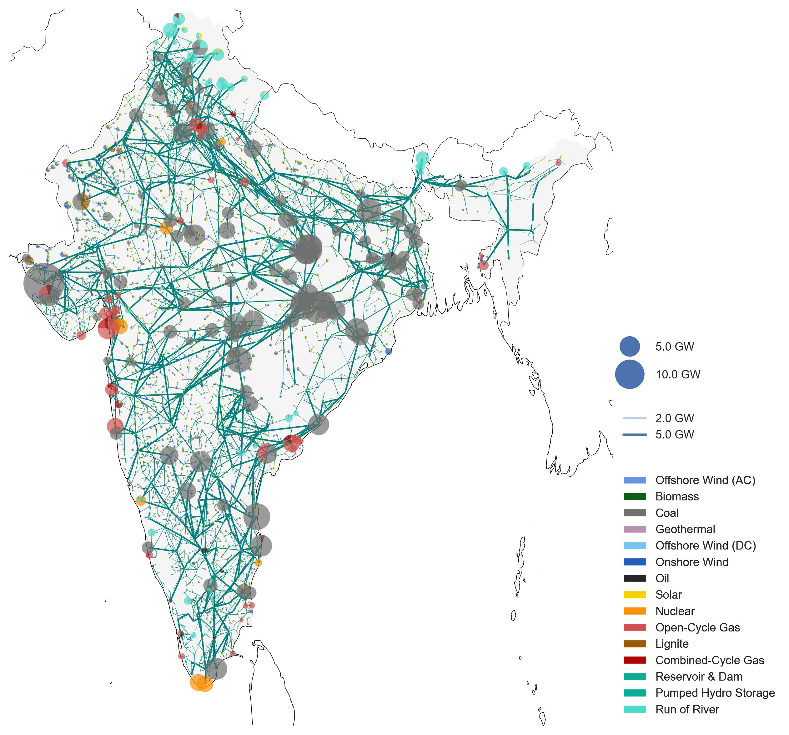
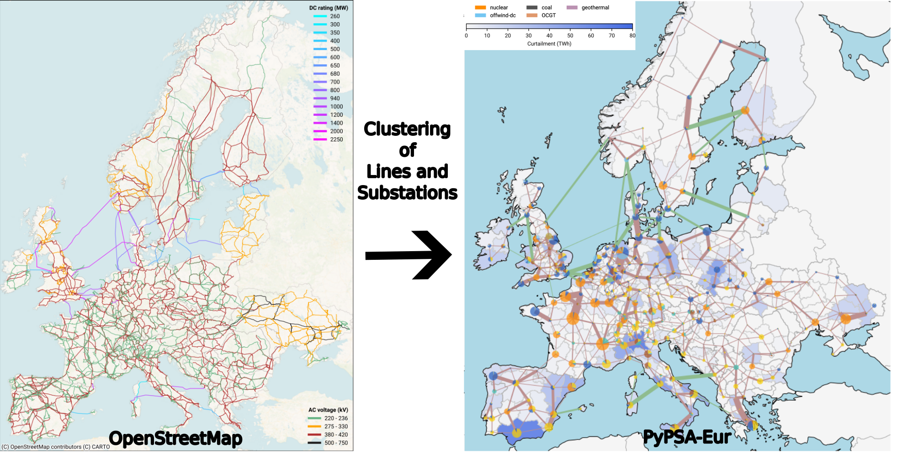
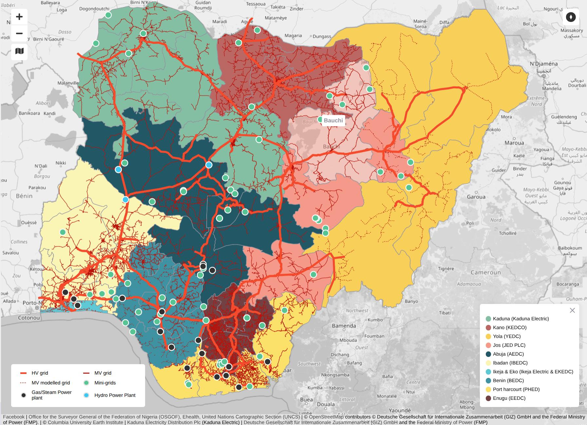
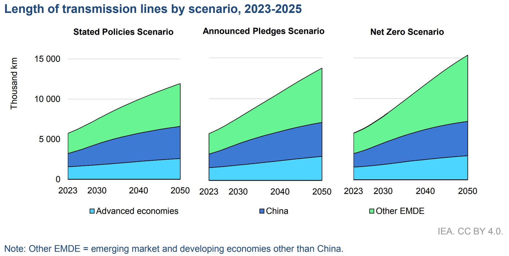
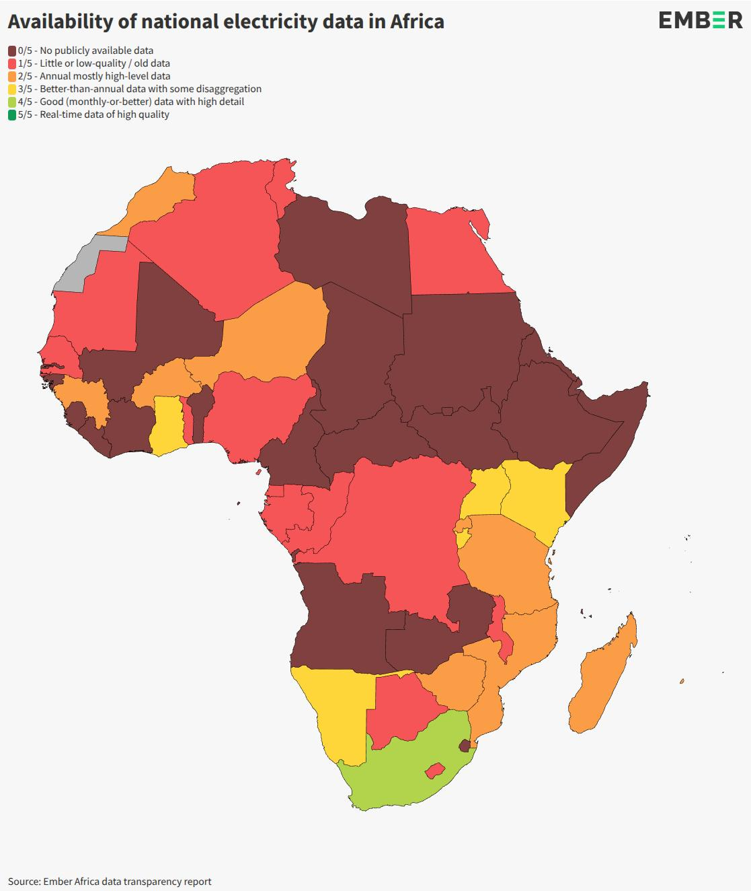
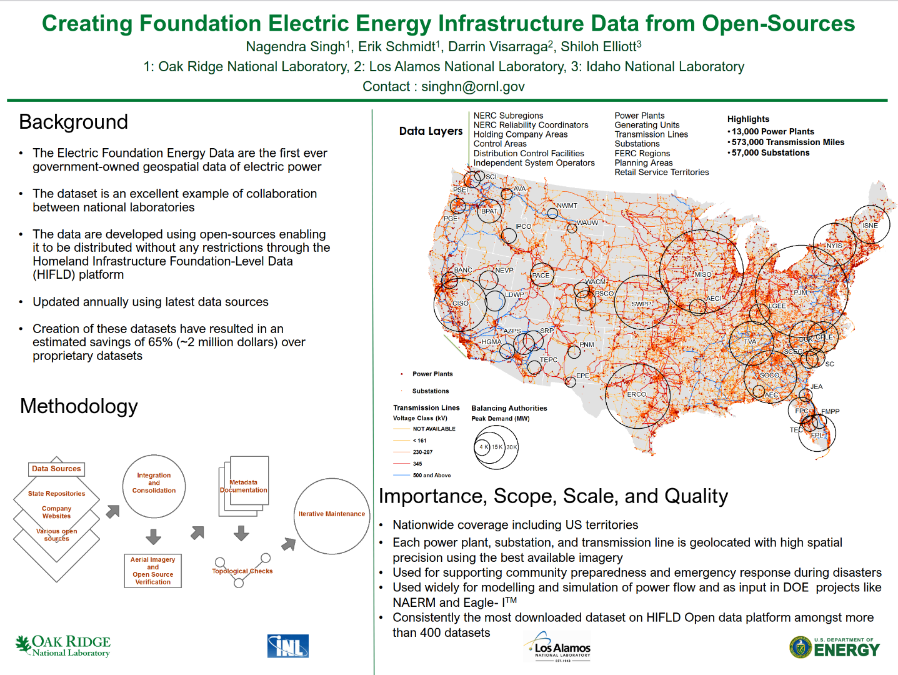
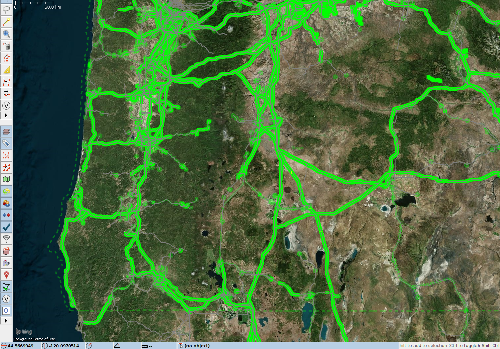

<h1>Impact </h1>

OpenStreetMap’s unique value in creating high quality data for sustainable development has been proven by multiple initiatives all around the world: 

  
  <figcaption class="image-caption">58 countries energy planning directly depend on OpenStreetMap <a href="https://map.vida.place/public/workspace/114d1c69-eb81-4e49-8434-0f038854f4a0"> like in this case Pakistan</a>. Click to enlarge.</figcaption>

  
  <figcaption class="image-caption">The PyPSA-Earth open-source energy system model uses OpenStreetMap data to study the future of energy around the world. Click to enlarge.</figcaption>

 

1. The [Global Electrification Platform](https://electrifynow.energydata.info/) and [Distributed Renewable Energy Atlas](https://dre.energydata.info/), developed and used by the World Bank, are used for planning electrification and expansion of renewable energy in rural areas across 58 countries. Using OpenStreetMap's transmission lines, roads, buildings, and settlements, it helps identify off-grid populations and informs planning for both grid and off-grid electrification strategies. gep-onsset, the Open Source Software behind Global Electrification Platform, [relies heavily on electrical grid data of OpenStreetMap](https://gep-onsset.readthedocs.io/en/latest/GIS%20data%20collection.html#infrastructure).

1. The [Humanitarian OpenStreetMap Team](https://www.hotosm.org/) provides high-quality, open geospatial data to inform decision-makers during early disaster response. More than 419,000 volunteer mappers have contributed to this initiative. The platform allows collaboration between multiple organizations, like satellite imaging providers like Maxar and humanitarian agencies such as the Red Cross. This collaborative platform ensures that critical, life-saving decisions are grounded in traceable and verifiable data. Especially as the frequency of extreme weather events increases, accurate electrical grid data [plays a key role in disaster response at the Humanitarian OpenStreetMap Team](https://github.com/USAFORUNHCRhive/turkana-grid-mapping).

1. The World Bank's [EnergyData.info](https://energydata.info/dataset/?q=OpenStreetMap) website hosts over 1,072 energy-related datasets, 533 of which directly depend on OpenStreetMap data. The World Bank uses this data to finance and support energy infrastructure projects in low- and middle-income countries, including expanding energy access, modernizing power systems, and promoting clean energy solutions. This data is been used to create report for Decision Makers such as [Mini Grids for Half a Billion People](https://www.esmap.org/sites/default/files/esmap-files/Mini%20Grids%20for%20Half%20a%20Billion%20People%20-%20OKR%20Download%20Version_compressed_MKA.pdf).

## **
How and why is it used for the Electrical Grid?
**

OpenStreetMap’s electrical grid data is actively used by grid operators, academic institutions, government agencies, local authorities, and private organizations. This data plays a crucial role in energy modeling and planning, informing both policy development and investment decisions. 

These simulations help to evaluate technological options, the impact of policies, and the pathways to achieving full electrification, especially in developing countries. Energy models are essential for advancing decarbonization goals and achieving sustainable development. However, the effectiveness of these models depends heavily on the **quality and completeness of the data** they rely on.

--- 

### Energy Modelling 

  
  <figcaption class="image-caption">PyPSA combines transmission lines and substations (left) to form larger energy links and buses between different regions (right). Image Source: <a href="https://pypsa-earth.readthedocs.io/en/latest/index.html" target="_blank">Modelling the high-voltage grid using open data for
Europe and beyond</a></figcaption> 

 

[PyPSA-Earth](https://pypsa-earth.readthedocs.io/en/latest/index.html) is the first energy model to enable regional studies based on OpenStreetMap to be carried out across the globe. The data is clustered into larger regional electrical hubs to simplify the power system model and improve computational efficiency. However, the energy potential of entire regions is underestimated if lines and substations are missing. Therefore, improving the current state of the OpenStreetMap's electrical grid data significantly enhances the reliability and effectiveness of this planning tool for energy studies in [regions all around the world](https://pypsa-earth.readthedocs.io/en/latest/users_list.html#). Initial attempts to use OpenStreetMap data for energy modeling are being made by the German Aerospace Center with the [SciGrid](https://www.dlr.de/en/ve/research-and-transfer/projects/project-scigrid) project starting in 2014. Afterwards project like [OSMoGrid](https://github.com/ie3-institute/OSMoGrid), [GridTool](https://github.com/IEE-TUGraz/GridTool), [osmTGmod](https://github.com/wupperinst/osmTGmod) and [OpenGridMap](https://github.com/opengridmap) have continued this development first focusing on the German electrical grid.

--- 

###  Valued by International Organizations

Organizations such as the **World Bank** and the **International Energy Agency (IEA)** rely on OpenStreetMap data for regional and continental energy analyses. In many cases, OpenStreetMap provides the **only available** source of open, accessible infrastructure data. Making such data publicly available adds considerable **societal value** for planning and clean energy transitions, while also creating **economic value** for the private sector:

   </a>
  <figcaption class="image-caption"> More than 240 million people in Nigeria depend on electrical grid data from OpenStreetMap. The <a href="https://pypsa-earth.readthedocs.io/en/latest/index.html" target="_blank">Nigerian SE4ALL website</a>, which is hosted by the Federal Ministry of Power, uses OpenStreetMap as its main source on the transmission grid.</figcaption> 

 

> **IEA Key Policy Recommendation in 2024:**
> “Improve data reliability and availability to better assess and manage risks for clean energy projects in emerging markets and developing economies.”           
[How to implement the COP28 energy goals](https://www.iea.org/events/from-taking-stock-to-taking-action-how-to-implement-the-cop28-energy-goals) 
--- 
> **IEA Actionable Recommendation in 2025:**
> “Policy makers, regulators and utilities must support institutions, regulations, technical standards and collaboration platforms to build consensus on effective planning approaches that take full account of the changes in the profiles of power systems and their operations. Encouraging Transmission System Operator to share procurement and capacity planning data with regulators will further support informed policymaking.       
[Building the Future Transmission Grid](https://iea.blob.core.windows.net/assets/a688d0f5-a100-447f-91a1-50b7b0d8eaa1/BuildingtheFutureTransmissionGrid.pdf)

--- 

### Energy Grids Shape Our Future

  
  <figcaption class="image-caption">Expanding and replacing transmission lines is vital to achieving global climate goals. By 2050, advanced economies aim to nearly double their grid capacity, while emerging economies plan to triple theirs. <a href="https://iea.blob.core.windows.net/assets/a688d0f5-a100-447f-91a1-50b7b0d8eaa1/BuildingtheFutureTransmissionGrid.pdf">IEA</a>, CC BY 4.0. Click to enlarge.</figcaption>

 

Reliable and open infrastructure data directly supports the **adoption and success of clean energy projects** globally. These projects are being accelerated for several critical reasons:

* **Climate mitigation:** Fossil fuels account for roughly 70% of global greenhouse gas emissions.
* **Resilience:** Clean energy strengthens resilience against climate impacts and extreme weather events.
* **Energy security:** Reducing reliance on imports enhances national energy independence, especially from politically unstable or hostile regions.

--- 

### Growing Academic Impact

To assess the influence of OpenStreetMap electrical grid data in research, we analysed Google Scholar for publications combining `OpenStreetMap` with terms like `power grid`, `electrical grid`, `renewable` or `energy model`.

* 10,700 publications since 2005 included combinations of these keywords.
* A total of **2,460 publications** were released in the last year alone, demonstrating a rapid increase in academic engagement with, and recognition of, the power of OpenStreetMap data.

## **
Why is it important that this data is open?
**

Access to open and accurate data on electricity infrastructure is essential for effective planning, development, and collaboration, especially in the context of the global energy transition. The benefits are far-reaching, particularly for developing countries and emerging economies.

### Bridging Data Gaps in Developing Countries

  
  <figcaption class="image-caption"> <a href="https://iea.blob.core.windows.net/assets/a688d0f5-a100-447f-91a1-50b7b0d8eaa1/BuildingtheFutureTransmissionGrid.pdf" target="_blank"> Ember - Africa Electricity Data Transparency 2025 </a>- Click to enlarge.</figcaption>

 

In many low- and middle-income countries, data on electrical infrastructure is **outdated, incomplete, or fragmented**. This presents a significant barrier for governments, utilities, and planners. Even in high-income countries, while data may be more comprehensive, it is often **not publicly available** or limited by restrictive licensing. This hinders transparency and the ability to collaborate or validate results.

Open data ensures that:

* Infrastructure planning is **more inclusive and cost-effective**.
* Datasets can be **cross-checked, reused, and improved** collaboratively.
* Policymakers and planners have **a reliable foundation** for decision-making.

--- 

### Transparency, Traceability and Public Trust

OpenStreetMap's unique mapping methodology, which cannot be replicated by proprietary mapping services using closed methods, enables traceability and [verifiability](https://wiki.openstreetmap.org/wiki/Verifiability): 

> "At the core, "verifiability" is that everything you do can be demonstrated to be true or false by other mappers."

Transparent planning, backed by open data, plays a key role in building **public trust**. Research has shown that openness increases public acceptance of infrastructure projects ([Ciupuliga & Cuppen, 2013](https://www.sciencedirect.com/science/article/abs/pii/S0301421513003601)).

Because OpenStreetMap is editable and collaborative, **local communities, NGOs, and governments** can contribute directly. This  leads to filling gaps, correcting errors, and improving the quality of infrastructure data. For example, the **YouthMappers** initiative in **Sierra Leone** enabled local students and organizations to map the power grid, helping electricity providers reduce planning costs and improve infrastructure deployment ([Charles, 2022](https://link.springer.com/chapter/10.1007/978-3-031-05182-1_11)).

Open grid data is also instrumental in identifying **off-grid communities** that could be connected to national networks, helping target interventions and investments ([Arderne et al., 2020](https://www.nature.com/articles/s41597-019-0347-4)).

--- 

### Economic Savings Compared to Proprietary Datasets 

  
  <figcaption class="image-caption">Creating Foundation Electric Energy Infrastructure Data from Open-Sources document. Click to enlarge.</figcaption>

 

OpenStreetMap's data has enabled the government and local authorities to create high-quality datasets without having to pay for expensive proprietary ones. For example, the US Department of Energy and partners have created the "Electric Energy Infrastructure Data" utilising open-source data, which led to **"estimated savings of 65% (~2 million dollars) over proprietary datasets"** ([Singh et al., 2023](https://www.energy.gov/sites/default/files/2023-01/poster-%20Creating%20Foundation%20Electric%20Energy%20Infrastructure%20Data%20from%20Open-Sources.pdf)).

--- 

### Examples from High-Income Countries
In most developed countries, publishing high-resolution, open datasets about the transmission grid has been common practice more than a decade. For example:

* [**ENTSO-E**](https://www.entsoe.eu/data/map/) provides a Europe-wide **Transmission System Map** with geo-referenced infrastructure data.
* The French grid operator **RTE** publishes its grid topology, including **5-minute resolution time-series data** on network operations ([RTE on GitHub](https://github.com/rte-france/structural-french-grid-data-with-detailed-topology-time-series)).
* Enedis, the French distribution system operator committed to Open Data since 2015, is [joining forces with OpenStreetMap France](https://www.enedis.fr/presse/open-data-enedis-participe-un-projet-collaboratif-mondial-dechange-de-donnees) to make its grid data available and encourage crowdsourcing.
* To find more open datasets about the electrical grid released by national authorities or electrical grid operators, check out our [curated a list](https://github.com/open-energy-transition/Awesome-Electric-Grid-Mapping) with more than 150 maps.

  
  <figcaption class="image-caption">
    Comparison of U.S. Homeland Infrastructure Foundation-Level Data (gray lines) with OpenStreetMap transmission data (green lines) shows matching spatial resolution. Click to enlarge.
  </figcaption>

In the United States, the Department of Homeland Security and other agencies publish national transmission grid data to support **emergency response, policy development, and economic planning**. These open datasets trace back to legislation from the 1990s that aimed to improve geospatial data sharing ([source](https://www.govinfo.gov/content/pkg/WCPD-1994-04-18/pdf/WCPD-1994-04-18-Pg779.pdf)). Within this dataset, 24% of US transmission lines state OpenStreetMap as their main source.

The [Homeland Infrastructure Foundation-Level Data](https://resilience.climate.gov/datasets/fedmaps::u-s-electric-power-transmission-lines/explore?location=38.846475%2C-76.984997%2C8.86) has shown **strong alignment** with OpenStreetMap data, demonstrating how open contributions can match official datasets in coverage and accuracy.

--- 

## **
Who uses OpenStreetMap grid data?
**

How does mapping have an impact? When you map towers, substations, power plants in OpenStreetMap, you are essentially adding valuable data that is used by many different entities. Below is a curated list of organisations and projects that have had an impact and have used this data.   

Disclaimer: These organisations are not affiliated with MapYourGrid nor endorse it. All logos and brand names are the property of their respective owners. Usage here is for informational purposes only, identifying organisations that utilise OpenStreetMap data.

**International Energy Agency**  {width=30px} 
??? "Energy and AI Observatory (Click Me)"
    
    [**Link to website**](https://www.iea.org/data-and-statistics/data-tools/energy-and-ai-observatory)
    
    {: .img-border }
 
??? "Latin America Energy Outlook Interactive Map (Click Me)"
    
    [**Link** - Latin America Energy Outlook Interactive Map (link)](https://www.iea.org/data-and-statistics/data-tools/latin-america-energy-outlook-interactive-map)
        
    {: .img-border }

**US Department of Homeland Security**  {width=30px} 
??? "Homeland Infrastructure Foundation-Level Data (HIFLD) (Click Me)"
    
    [**Link to website**](https://hifld-geoplatform.hub.arcgis.com/datasets/3486fb60feb2454c99232248fdf624ec_0/explore)
    
    {: .img-border }

**World Bank**  {width=70px} 
??? "Africa Electricity Grids Explorer (Click Me)"
    
    [**Link** - Africa Electricity Grids Explorer (link)](https://africagrid.energydata.info/)
    
    {: .img-border }

**PyPSA-Earth** {: width=70px} **+** **PyPSA-Eur** {: width=30px}
??? "PyPSA-Earth and Europe use OpenStreetMap data for energy system studies all around the world. (Click Me)"
    
    [**Link to website**)](https://pypsa-earth.readthedocs.io/)
        
    {: .img-border }

**Enedis**  {width=70px} 
??? "The French utility company Enedis, operating the electricity distribution network, mapped power poles and substations with the help of a strong local OpenStreetMap community. (Click Me)"
    
    [**Link to website**](https://enedis.openstreetmap.fr/)
        
    {: .img-border }

**Global Renewables Watch**  {width=70px} 
??? "The Global Renewables Watch maps and measures renewable energy installations and their estimated capacities at the subnational, national, and global levels. The machine learning behind the detection process is mainly trained using OpenStreetMap data. (Click Me)"
    
    [**Link to website**](https://www.globalrenewableswatch.org/)
        
    {: .img-border }
 
**CONAHCYT (Gobierno de Mexico)**  {width=70px} 
??? "Mapa del Sistema Eléctrico Nacional (Click Me)"
    
    [**Link to website**](https://energia.conacyt.mx/planeas/electricidad/sistema-electrico-nacional)
    
    {: .img-border }
 
**European Commission - Joint Research Centre**  {width=40px} 
??? "Africa Knowledge Platform (Click Me)"
    
    [**Link to website**](https://africa-knowledge-platform.ec.europa.eu/explore_maps)
    
    {: .img-border }

    **More Information**
    - The electricity network data on the image is a mix of World Bank and OpenStreetMap data 
 
**IRENA**  {width=55px} 
??? "Global Atlas for Renewable Energy (Click Me)"
    
    [**Link to website**](https://globalatlas.irena.org/workspace)
        
    {: .img-border }
 
**Global Wind Atlas**  {width=15px} 
??? "Global Wind Atlas (Click Me)"
    
    [**Link to website**](https://globalwindatlas.info/en/)
        
    {: .img-border }

**Fraunhofer ISE**  {width=45px} 
??? "Energy Charts (Click Me)"
    
    [**Link to website**](https://www.energy-charts.info/map/map.htm?l=en&c=DE&country=DE&lines=1110000&pp-source=bnetza&pp-bitmap=none)
    
    {: .img-border }

**ESMAP, IFC, VIDA** {width=45px} {width=65px} {width=45px}
??? "Distributed Renewable Energy (DRE) Atlas (Click Me)"
    
    [**Link to website**](https://dre.energydata.info/)
        
    {: .img-border }

**GridRaven** {width=15px} 
??? "Dynamic Line Ratings with precision weather forecasting (Click Me)"
    
    [**Link to website**](https://claw.gridraven.com/world)
        
    {: .img-border }

**windPRO** {width=15px}
??? "windPRO is an industry standard for designing, planning, and evaluating wind and solar energy projects. (Click Me)"
    
    [**Link to website**](https://help.emd.dk/mediawiki/index.php/EMD_Electrical_Grid_Map)
        
    {: .img-border } 

**ETAP** {width=25px}
??? "ETAP® provides market-leading software and hardware solutions serving all stages of the electrical system lifecycle for utilities, infrastructure, industries and buildings. (Click Me)"
    
    [**Link to website**](https://etap.com/product/gis-for-electric)
    
    {: .img-border } 

**GlitreNett** {width=40px}
??? "DataArena intends to inform and provide information about the status of the Norway electrical grid capacity. (Click Me)" 
    
    [DataArena intends to inform and provide information about the status of the Norway electrical grid capacity.](https://etap.com/product/gis-for-electric)
        
    {: .img-border } 

**MAPOG** {width=40px}
??? "How GIS Enhances Power Grid Mapping and Energy Infrastructure Planning. (Click Me)" 
    
    [**Link to website**](https://www.mapog.com/power-grid-and-infrastructure-mapping-and-planning-using-gis/)
        
    {: .img-border } 

**dvlp.energy** {width=40px}
??? "With dvlp.energy, you can quickly and easily find the right space for your solar, wind or storage projects. (Click Me)" 
    
    [**Link to website**](https://www.dvlp.energy/en)
        
    {: .img-border } 

**Roseau Technologies** {width=40px}
??? "Modern and ergonomic software solutions for straightforward electricity distribution grid design. (Click Me)" 
    
    [**Link to website**](https://www.roseautechnologies.com/en/home/)
        
    {: .img-border } 

