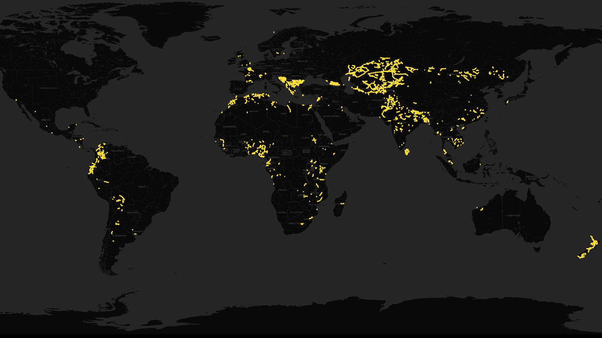

<h1>Our Progress</h1>

</a> 
<figcaption class="image-caption">Global overview of all lines mapped by MapYourGrid in 2025. Click to enlarge.
</figcaption>

MapYourGrid measures its progress at user, hashtag and country level. We would be honoured to make your progress part of the initiative. If you use our tools and training courses please use the #MapYourGrid hashtag in your changesets or add your user id to our [KPI script](https://github.com/open-energy-transition/MapYourGrid/blob/main/.github/workflows/update-tower-count.yml). If you would like to contribute to our development or keep up to date with our progress, take a look at our public [organization project management](https://github.com/orgs/open-energy-transition/projects/25/views/7) and [roadmap](https://github.com/orgs/open-energy-transition/projects/25/views/13). You may have noticed that our KPIs currently prioritise coverage over data quality. This is because our initiative is working to increase coverage in low- and middle-income countries, resulting in more issues appearing in this grid. However, quality KPIs are currently under development and will be based on the [quality assurance layers that we are implementing simultaneously](tools.md/#quality-assurance-and-validation).

     <a href="#country-list" class="btn btn-primary">
      Country list 🌐
     </a>
      <a href="#community-mapping-progress" class="btn btn-primary">
        Community Mapping Progress 👥
      </a>
      <a href="#line-length-growth-per-country" class="btn btn-primary">
        Line Length Growth per Country 📈
      </a>
      <a href="#interconnectors" class="btn btn-primary">
        Interconnectors ⚡
      </a>

<!-- Countries Section -->
## **
Country list 
**

We contribute to mapping the grid all around the world. Discover our main contributions in different countries:

{width=20px} [Bangladesh](countrypages/Bangladesh.md) - 
{width=20px} [Benin](countrypages/Benin.md) -
{width=20px} [Bolivia](countrypages/Bolivia.md) - 
{width=20px} [Bosnia and Herzegovina](countrypages/Bosnia and Herzegovina.md) - 
{width=20px} [Cambodia](countrypages/Cambodia.md) - 
{width=20px} [Colombia](countrypages/Colombia.md) -
{width=20px} [Georgia](countrypages/Georgia.md) - 
{width=20px} [Kazakhstan](countrypages/Kazakhstan.md) - 
{width=20px} [Kenya](countrypages/Kenya.md) - 
{width=20px} [Mongolia](countrypages/Mongolia.md) - 
{width=20px} [Nepal](countrypages/Nepal.md) -
{width=20px} [Nigeria](countrypages/Nigeria.md) - 
{width=20px} [Pakistan](countrypages/Pakistan.md) - 
{width=20px} [Sri Lanka](countrypages/Sri Lanka.md) - 
{width=20px} [Turkmenistan](countrypages/Turkmenistan.md) -
{width=20px} [Uganda](countrypages/Uganda.md) - 
{width=20px} [Uzbekistan](countrypages/Uzbekistan.md) - 

<!-- Progress Bars Section -->
## **
Community Mapping Progress 
**

 
   <button id="refresh-btn" style="margin-bottom:1rem;">
     🔄 Refresh stats (only click if the bars are not "loading...")
   </button>

  

    <label>Contributors mapping with <code>#MapYourGrid</code> hashtag:</label>
    
 

 

    Loading…
  

  

    <label>Total Edits for <code>#MapYourGrid</code> hashtag:</label>
    

      

 

    Loading…
  

  

    <label>Total estimated power towers added by mappers of the MapYourGrid funding organisations:</label>
    

      

    

    Loading…
     
    Last updated: —
  

  

    <label>Total estimated length of power lines added by mappers of the MapYourGrid funding organisations:</label>
    

      

    

    Loading… 
    
      Last updated: —
    
  

  

    <label>Total Estimated Global Power Capacity added by mappers of the MapYourGrid funding organisations:</label>
    

      

    

    Loading…
     
    Last updated: —
  

  

    <label>Total estimated substations added by mappers of the MapYourGrid funding organisations:</label>
    

      

    

    Loading…
     
    Last updated: —
  

  

    <label>Total estimated power towers added by people using the <code>#MapYourGrid</code>:</label>
    

      

    

    Loading…
     
    Last updated: —
  

  

    <label>Total estimated length of power lines added by people using the <code>#MapYourGrid</code>:</label>
    

      

    

    Loading… 
    
      Last updated: —
    
  

You can find more stats for #mapyourgrid at [OhsomeNowstats](https://stats.now.ohsome.org/dashboard#hashtag=MapYourGrid&start=2025-03-12T22:00:00Z&end=2025-05-14T21:59:59Z&interval=P1M&countries=&topics=).

## **
Line Length Growth per Country 
**

This table shows the total growth in line length for all countries around the world, as calculated using pre-processed statistical data of [ohsome stats](https://stats.now.ohsome.org/).

<iframe src="../data/power_line_length_table.html" width="100%" height="600px" style="border:none;"></iframe>

<!-- Countries Section -->
## **
Interconnectors 
**

We mapped several international interconnectors, as it is shown on the map below:

</td>

