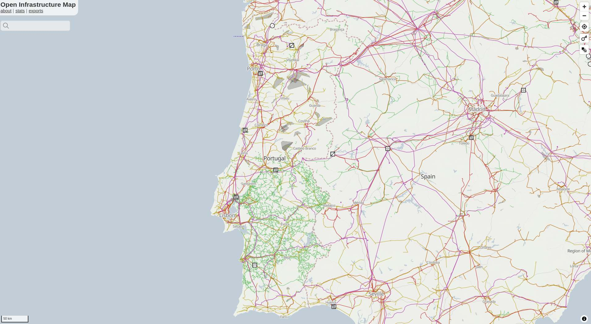
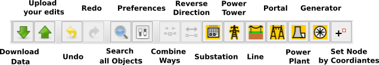
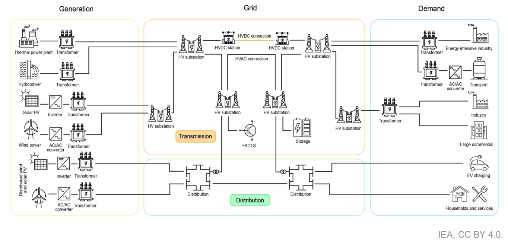

<h1>Starter-Kit </h1>

<figcaption class="image-caption">
<a href="https://openinframap.org/#6.54/39.026/-7.548" target="_blank">Open Infrastructure Map</a> showing the detailed transmission and distribution grid in Portugal. Click to enlarge.
</figcaption>

This starter kit empowers you how to map your first line of the electrical transmission grid. If you ever get stuck with the Starter Kit or would like to provide feedback, please contact us via our [community chat](https://discord.gg/fBw7ARTUeR) or [via email](mailto:MapYourGrid@openenergytransition.org). A MapYourGrid community member will help you finish your first line and set up your environment.

We recommend JOSM for professional, large-scale grid mapping and to inspect the electrical grid. However, if you only want to make minor edits or leave notes without installing anything, the iD editor in combination with Open Infrastructure Map and MapComplete is a better choice. These tools also offer enhanced usability for field mapping tasks and data validation.

Get started by clicking on one of the OpenStreetMap editors:

  <a href="#josm-starter-kit" style="display: inline-block; padding: 10px 15px; background-color: #2050a0; color: white; text-decoration: none; font-size: 18px; border-radius: 8px;"><strong>JOSM Starter-Kit</strong> - Large Scale Mapping</a> 

  <a href="#id-starter-kit" style="display: inline-block; padding: 10px 15px; background-color: #2A6D3C; color: white; text-decoration: none; font-size: 18px; border-radius: 8px; margin-top: 6px;"><strong>iD Starter-Kit</strong> - Small Scale and Field Mapping</a> 

  <a href="#mapcomplete-starter-kit" style="display: inline-block; padding: 10px 15px; background-color: #2A6D3C; color: white; text-decoration: none; font-size: 18px; border-radius: 8px; margin-top: 6px;"><strong>MapComplete Starter-Kit</strong> - Mapping Missing Tags</a>

## 
JOSM Starter Kit
</h3>
    
### **
1. Install and Configure JOSM  
** 

   </a>
  <figcaption class="image-caption">This is what your JOSM should look like after setting up the Starter-Kit. Click to enlarge.</figcaption>
   </a>
  <figcaption class="image-caption">Different preferences that need to be configured, including the Power Presets. Click to enlarge.</figcaption>

1. Install [Java](https://www.java.com/en/download/help/download_options.html) on your device.  
1. Install [JOSM](https://josm.openstreetmap.de/) on your device (if needed, further instructions on how to install and use JOSM on your device can be found at [learnOSM](https://learnosm.org/en/josm/start-josm/)).
1. Link your OSM account to JOSM. Go to `Preferences → OSM Server` and select "Authorise". Login with your OSM account. Be aware that your token is now stored in your local preferences.xml file. Do not share this file with anyone.  
1. Enable `Remote control` in `Preferences → Remote Control`. This allows for grid data to be loaded automatically.
1. Enable `Expert Mode` `View → Expert Mode` to enable search function that you will need. 
1. Understanding JOSM layers. JOSM works with stacked layers, similar to Photoshop or GIS tools:
    * You’ll typically have an OSM data layer, imagery layers, and optionally GeoJSON or task layers.
    * You can switch between multiple satellite imagery sources (for instance, Esri, Mapbox) to use the clearest one for your area.
1. Create an OSM [account](https://www.openstreetmap.org/user/new) if you don't have one. Once you do, go to `Preferences → OSM Server` and press authorise now. Login with your OSM account, and authorise. Your account is now linked to JOSM on your device.
1. Load your Satellite Imagery via `Imagery` and select `Bing aerial imagery` and `Esri World Imagery`. In the `Layers` window on the right hand side you can now `Show/hide` the different imagery. This is also where you will load additional data layers. Changing the order of the data and imagery allows you to combine and overlap the different data sources.

!!! note
    The JOSM Preferences window is accessed through the `Edit → Preferences` menu on Windows and Linux, and `JOSM → Settings` on Mac.

### **
2. Setup your Presets 
**

   
  <figcaption class="image-caption">Default MapYourGrid Presets in JOSM toolbar. Click to enlarge.</figcaption>

1. For ease of mapping, customise your top toolbar with presets if you have not used the default preferences. Right click the toolbar and choose `Configure toolbar`, then select `Presets → Man Made → Man Made/Power` and add `Power Towers`, `Power Portal`, `Power Substation`, `Power Plants`, `Power Line` and `Power Generators`. This are the main objects to will need for transmission grid mapping. 
2. Another important Preset your will need is `Add Node`. You will find it under `Tools` → `Add Node`. 

    
### **
3. Add visual clarity with custom map styles :art:
**

  
  <figcaption class="image-caption">OhmyGrid legend for transmission grid mapping. Click to enlarge.</figcaption>

 
1. In JOSM, go to `Preferences → Map Paint Styles` and press the "+" in the top right.
2. Paste this [URL](https://raw.githubusercontent.com/open-energy-transition/color-my-grid/refs/heads/main/ohmygrid-default.mapcss), or download the raw [file](https://github.com/open-energy-transition/color-my-grid/blob/main/ohmygrid-default.mapcss) on your device, and add it.
3. Make sure the style is active in the Map Paint Styles menu. 

**Optional steps for an even better visual experience :**

* Not all grids are made the same. Use this MapCSS file for [low-density grids](https://raw.githubusercontent.com/open-energy-transition/color-my-grid/refs/heads/main/ohmygrid-default.mapcss), or this one for [high-density grids](https://raw.githubusercontent.com/open-energy-transition/color-my-grid/refs/heads/main/ohmygrid-default.mapcss). 
* Check [ColorMyGrid](https://github.com/open-energy-transition/color_my_map), our MapCSS Generator tool, to easily adapt the MapCSS file to your needs. The raw data to edit the [map legend](https://raw.githubusercontent.com/open-energy-transition/color-my-grid/refs/heads/main/legend/power-grid-legend.png) is in the ColorMyGrid repo. 

### **
4. Let's map! Choose a Good First Line 
**

Our community is constantly investigating transmission lines that are suitable for beginner friendly mapping experiences. Simply select a 'Good First Lines' from the following spreadsheet, and tick it if you have started mapping it:

??? success "Good First Lines (Click Me)"
    <iframe
     src="https://docs.google.com/spreadsheets/d/13YZftK9xZ09t2oSvhwjE0Zb7P25nl9OaUAxIBVNH0js/edit?usp=sharing&rm=minimal"
     class="iframestyle"
     style="width:100%; height: 500px; border:1px solid #ddd; ">
    </iframe>

### **
5. Load Power Infrastructure into JOSM :inbox_tray:
**

   </a>
  <figcaption class="image-caption">A substation of a hydroelectric power plant in Nigeria and the connection to the transmission grid.</figcaption>

1. Make sure remote control is enabled and ad-blocker disabled, and then go to the start mapping [page](https://MapYourGrid.org/map-it/). 
1. Here you can click on the country you want to map, and it will directly open JOSM and load the data of that country. The "Default Transmission (90kV+)" data should already be selected when you open the page. Now press the country, state or province of the `Good First Line` you would like to map. To load data for provinces or states, simply zoom in further until the border becomes visible. 
1. The data should now automaticlly appear in JOSM. In the `Layer` window on the right handside you should see the `Data Layer`. The ✅ on the left of the Data Layer should be visible, indicating that this is the active layer. All your edits in the main windows will now be part of this `Data Layer` 
1. Familiarize yourself with the grid data, click on the lines and substation to inspect the tags and memberships in the window in the right side. 

### **
6. Map your First Line
**

  
  <figcaption class="image-caption">Key JOSM elements for continuing a transmission line. Click to enlarge.</figcaption>
   
  <figcaption class="image-caption">Selecting all the finished notes in a line enables you to quickly turn them into Power Towers.</figcaption>
  
  <figcaption class="image-caption">Before uploading, JOSM will test your edits for known issues and various rule sets. Try to resolve as many validation results as possible. Click to enlarge.</figcaption>

 Mapping is an iterative process, so you will make mistakes. However, this should not stop you from mapping; simply map what you can see in the imagery. Those who are new to the field should avoid altering existing data at all costs. However, you cannot break anything by adding new data, as this is constantly validated by our quality assurance tools. Now Start Mapping:

1. Zoom in on the satellite imagery until you can see the houses and roads.
1. Copy the Coordiantes of your `Good First Line` and press the `Add Node`  presets button. Enter the coordiantes here and press Ok. You should now see power towers that are not mapped at the end of a transmission line.
1. Now, press `Draw Line`  the last tower symbol at the end of the line. You should now be able to extend the line. 
1. Search for the next power towers you can find and click on its footprint. 
1. If you ever feel unsure about how the line runs just place towers without the lines. By adding power towers you can do nothing wrong. Adding power towers is the easiest way to get started.
1. Continue the line to the best of your ability press CTRL+F while the line is still selected. Select all nodes you have created by Entering `child selected type:node AND untagged` as search string. Now Press `Search` to select all nodes without a tag. 
1. Now press the `Power Tower`  preset followed by `Apply Preset`.

### **
7. Upload your work :outbox_tray: 
**

1. With having the `Data Layer` activated, press the Green Upload arrow pointing upwards . 
1. A new window will apear in the right panel showing all the issues identified. Right-clicking on an issue will allow you to zoom in on it. Avoid ignoring this validation results. The only acceptable warning when uploading data is `Possible missing line support node within power line`. 
1. Please set the `I would like someone to review my edits` tick box if your mapping has been strongly affected by uncertainties like low-quality satellite data, or if you are a beginner.
1. You just mapped your First Good Line. Feel free to close more First Good Lines, but make sure you leave some for the others. You can use the [Tools and Strategies](tools.md) we have provided to find your own unmapped line. To support our initiative, please use the #MapYourGrid hashtag in the comments you make in the changeset.

## **
 Avoid these common mistakes :name_badge:
**

   </a>
  <figcaption class="image-caption">In particular, in the dense urban areas that are widespread in Nigeria, it can be very difficult to determine the route of the lines in satellite images. Therefore, mappers simply place unconnected power towers that appear as blue squares at higher zoom levels.</figcaption>

Mapping is an iterative process and mistakes happen. This should not stop you from mapping; simply map what you can verify based on your skillset. If a tower, lines or attributes are missing, our quality assurance tool Osmose will automatically detect this.

1. Our tools focus on transmission grids, that’s why you don’t see lines below 90 kV. To see already mapped lines below 90 kV or lines tagged with power=minor_line, download the whole area you’re working on with the green arrow pointing down.
2. When mapping, make sure to not go across the border of the country you’re working on (visible dashed orange lines). Otherwise, you may find yourself mapping something that already exists, but hasn’t been downloaded in JOSM.
3. Don’t map beyond your expertise. If unsure, leave it for experienced mappers or locals, make a fixme tag, or ask the community! If you ever feel unsure about where to place the lines, just focus on adding power towers. You can't go wrong this way. Adding power towers is the easiest way to get started.

For a safe mapping, we recommend you reading about [good practices](https://wiki.openstreetmap.org/wiki/Good_practice).

!!! note
    **⚠️ In some countries, mapping power lines is restricted. Always verify local guidelines, connect with the OSM local community first, or check out the [local projects](https://wiki.openstreetmap.org/wiki/Power_networks#Local_projects).**
    
    **⚠️ By following our [Code of Mappers](./code-of-mappers.md), we collectively protect the integrity of the OSM platform, foster trust with communities, and unlock the power of open data for a more resilient and just energy future.** 

## **
What else? Learn the grid basics 
**
You don’t need to be a grid expert to start mapping, but a little knowledge helps!
The following documents and materials will give you a basic understanding of how to map an electrical grid.

The [Learning Curve](https://www.youtube.com/@TheLearningCurveBenila/videos), is a YouTube channel that will help you understand the fundamental knowledge of the electrical grid. Here some video we recommend for grid mappers. 

1. [Electrical Line Supports - Transmission Towers & Poles](https://www.youtube.com/watch?v=AB1qYsiDm0M)
1. [Components of Overhead Transmission Lines](https://www.youtube.com/watch?v=A6fwq3yHRXQ)
1. [Comparison between HVAC and HVDC transmission system](https://www.youtube.com/watch?v=l9nHs8e0WUg)

The following image is take from the report Key technology components of electricity grids Source: IEA - [Electricity Grids and Secure Energy Transitions](https://iea.blob.core.windows.net/assets/ea2ff609-8180-4312-8de9-494bcf21696d/ElectricityGridsandSecureEnergyTransitions.pdf).

  
  <figcaption class="image-caption">Key technology components of electricity grids Source: IEA - Electricity Grids and Secure Energy Transitions.</figcaption>

## 
Still "On the Line" and Motivated to Continue?

Well done on making it this far! We are offering free, hands-on transmission grid mapping workshops to people who have tried the Starter-Kit. You are very welcome to join our [community chat](https://discord.gg/a5znpdFWfD) called _📍-mapyourgrid_ on the PyPSA-Earth discord channel. Here you can ask questions, and interact with the community. For mapping specific questions and to participate in our free personalized training, please join our [📍-mapyourgrid-support-and-training](https://discord.gg/fBw7ARTUeR) channel. 

Check out our [Tools and Strategies](tools.md) to learn how to find your own new lines and become a grid mapping expert! You are also welcome to join our community calls and tutorials to learn more about the mapping process and the initiative. The OpenStreetMap Wiki pages [The Power Network](https://wiki.openstreetmap.org/wiki/Power_networks) and [Key:Power](https://wiki.openstreetmap.org/wiki/Key:power) provide an overview of how to map different power infrastructure.

<iframe src="https://calendar.google.com/calendar/embed?height=600&wkst=1&ctz=Europe%2FBerlin&showPrint=0&title=Community%20live%20sessions&src=Y182ODE3NjE1MGIzMjY4MGRkZmUzMGM1ZTE1MDU0YTc5MTVhMzY2NmY1OGY5NjkxOGVjOTZhNDJjZWQwODQ2ZGVmQGdyb3VwLmNhbGVuZGFyLmdvb2dsZS5jb20&color=%23AD1457" style="border:solid 1px #777" width="800" height="600" frameborder="0" scrolling="no"></iframe>

## 
iD Starter-Kit
</h3>

Although editors such as iD and MapComplete offer a simpler way to contribute to smaller grid mapping, they quickly reach their limits with large lines and complex geometries. However, these platforms have clear advantages for mapping in the field using mobile devices compared to JOSM. For people who prefer iD over JOSM, the following tutorials can also be used to map on a PC.

Also, if you just want to add a note or report an issue, or if you want to suggest the addition of power towers or substations in your area, this platform offers a great way to make a quick contribution. Taking images in the field with MapComplete is also key to validating satellite-based mapping where detailed, high-resolution images are missing. Taking images can also be important for deriving relevant metadata, such as wind [turbine power capacities](https://mapcomplete.org/openwindpowermap.html?z=13&lat=39.548330293512805&lon=9.219887340880064). We are currently working on extending this functionality to power towers to enable more accurate estimation of transmission line voltages.

### 
Reporting Issues in the Grid
</h3>

The fastest and easiest way to contribute to your electrical grid is by adding notes where you see missing or incorrect information in OpenStreetMap. You can do this fully anonymously—no login required.

  
  <figcaption class="image-caption">Open Infrastructure Map (left) and the iD Editor (right) provide a mobile-ready, easy-to-use way to report issues. Click to enlarge.</figcaption>

**Steps to Report an Issue**

1. Go to the [Open Infrastructure Map](https://openinframap.org/#2/26/12).
2. Click **Find my location** in the top-right corner or search for your city.
3. Click on a substation, power tower, power line, or power plant where you want to report an issue.
4. In the description window, click the **OpenStreetMap** logo.
5. The [OpenStreetMap.org](https://www.openstreetmap.org/) interface will now open at that location.
6. Click the **Add a note to the map** button on the right-hand panel.
7. Add a short description of the issue, and include the hashtag `#mapyourgrid` so we can find your note.

Reporting such smaller issues will significantly improve the long-term quality of your local grid's data.

### 
Add Power Towers or Substations using iD
</h3>

  
  <figcaption class="image-caption">To place a power tower, you first have to set a node and then add a tag (left). To save your edits on a mobile device using the iD Editor (right), you have to close the inspector panel on the left so that the Save button is visible. Click to enlarge.</figcaption>

Have you spotted some power towers, power plants, or substations near your place that are still missing and want to quickly map them yourself? This can be done on your mobile device or PC using the iD editor. In this way, you can also correct voltages, circuits, or other errors you see in Open Infrastructure Map.

**Add Power Towers**

1. Go to the [Open Infrastructure Map](https://openinframap.org/#2/26/12).
1. Click **Find my location** in the top-right corner or search for your city.
1. Zoom in until you see the small `Edit` button in the lower right corner and press it.
1. [Create an OpenStreetMap account](https://www.openstreetmap.org/user/new?cookie_test=true&referer=%2Fedit%3Feditor%3Did) and log in to the `Edit` mode by pressing the button on the top panel.
1. You will now see all OpenStreetMap and `Bing` Satellite imagery underneath. Depending on your region, you might want to switch to different satellite imagery by pressing the Background button in the right panel.
1. By pressing the `Point` symbol in the upper panel, you can now place a node. Now tag this node as a Power Tower using the `Edit Feature` that will appear on the left side. Although filling out the other fields is optional, you are welcome to provide additional information if you know more about the type of power tower.
1. Upload your data by pressing `Save`. On mobile devices, you first have to hide the left window by toggling the `Inspect` button at the top.
1. Add a `Changeset Comment` with a brief description of your mapping activity. If you find our efforts, documentation and tools helpful, please include the hashtag #mapyourgrid in the changeset comment to let us know.

**Add Substations**

  
  <figcaption class="image-caption">For mapping substations in iD we recommend using a PC. Click to enlarge.</figcaption>

1. Go to the [Open Infrastructure Map](https://openinframap.org/#2/26/12).
1. Click **Find my location** in the top-right corner or search for your city.
1. Zoom in until you see the small `Edit` button in the lower right corner and press it.
1. [Create an OpenStreetMap account](https://www.openstreetmap.org/user/new?cookie_test=true&referer=%2Fedit%3Feditor%3Did) and log in.
1. By pressing the `Area` symbol in the upper panel, you can now mark the substation. Tag this area as a `Substation` using the `Edit Feature` that will appear on the left side. Add voltages, operators, or other fields if you have this information.
1. Now upload this information by pressing `Save`.
1. Add a `Changeset Comment` with a brief description of your mapping activity. If you find our efforts, documentation and tools helpful, please include the hashtag #mapyourgrid in the changeset comment to let us know.

### 
Map Transmission Lines using iD 
</h3>

iD also offers you the option of extending Transmission Lines, also known as Power Lines, or creating new Transmission Lines. Even if this is theoretically possible on a mobile device, we recommend doing this with a mouse and keyboard on a PC.

  
  <figcaption class="image-caption">For mapping substations in iD we recommend using a PC. Click to enlarge.</figcaption>
  
  <figcaption class="image-caption">Depending on the region you are mapping, regularly switching between satellite images can help you identify power towers much more easily. Click to enlarge.</figcaption>

1. First, you have to set a Power Tower if you don't already have a line you want to extend.
2. Then press the Line symbol in the upper panel. Click on the power tower and draw the line to the next power tower.
3. Click on the node you have just created and make it a power tower with the `Inspect` window on the left side.
4. Afterwards, press on the line. In the `Inspect` window on the left side, you are now able to set the feature of this line as `Power Line`.
5. If you know further important information about the line like the voltage, operator, or the circuits, you are welcome to add this or leave these fields empty.
6. To further continue the line, select the power tower and press `CTRL C` to copy the tower. Now place it on the next tower you find.
7. Afterwards, continue the line as far as you can by connecting all the power towers you have just set.
8. Now upload this information by pressing `Save`.
9. Add a `Changeset Comment` with a brief description of your mapping activity. If you find our efforts, documentation, and tools helpful, please include the hashtag #mapyourgrid in the changeset comment to let us know.

## 
MapComplete Starter-Kit
</h3>

  
  <figcaption class="image-caption">MapComplete allows you to add missing information to objects like wind turbines (left). The platform allows you to upload images so that others can derive information like power output of the wind turbine. Click to enlarge.</figcaption>

The [MapComplete](https://mapcomplete.org/) platform provides an easy way to identify missing tags [like the power output of a wind turbine](https://mapcomplete.org/openwindpowermap.html?z=13&lat=39.55702450000146&lon=9.226502599999435#node/5271617498) that has already been mapped in OpenStreetMap. Like iD, the platform can be used from a PC but also from a mobile device. A special feature is the ability to upload images. In the case of a wind turbine, for example, this enables another mapper to estimate the output on the basis of this data. We are currently in development to extend this feature to Power Towers to derive the voltages, number of circuits, or cables from these images.

1. Open [MapComplete](https://mapcomplete.org/) and select the thematic map like `Wind power generators` that you would like to improve.
2. Jump to your location using the crosshair symbol in the lower right corner.
3. Search for wind turbines in your region that are missing information.
4. Press on the wind turbine symbol. You can now add the capacity or take a picture with your mobile device to let others derive the output power.
5. Afterwards, press `Save`.

